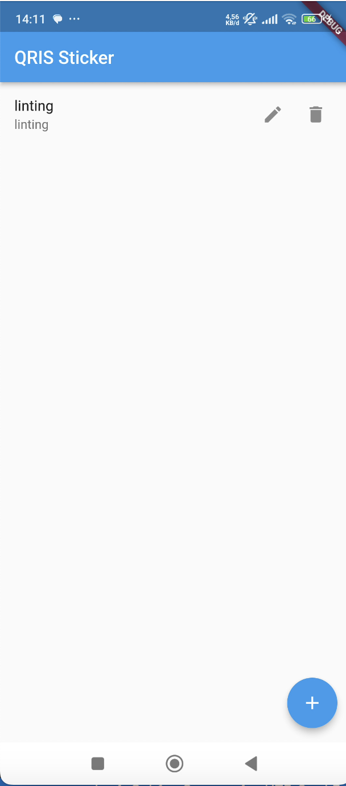
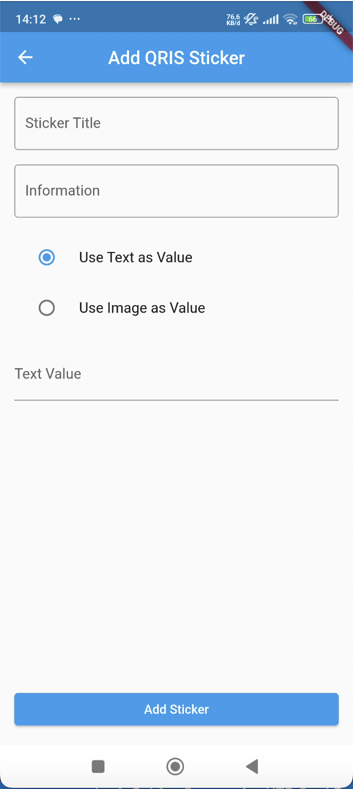
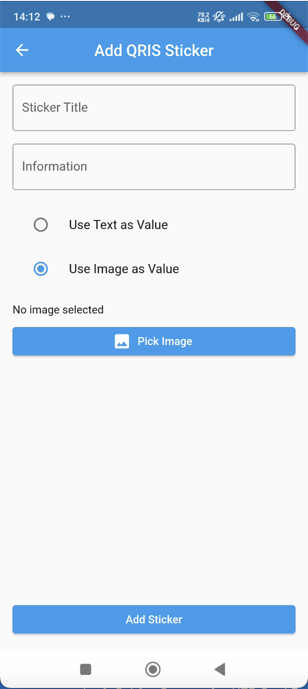
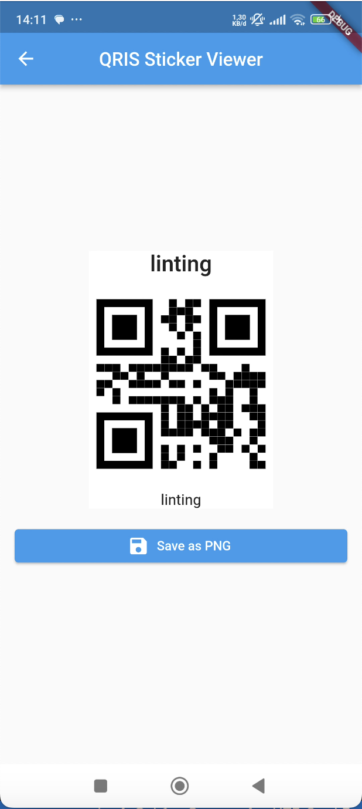

# QR Code Sticker App

This app allows users to manage QRIS stickers by generating, saving, and exporting QR codes. The app includes the following features:

- Input QR code using raw data
- Input QR code using PNG image
- Export QR code as PNG with caption title and information each at the top and bottom

## Features

### 1. **Input QR Code Using Raw Data**

- Users can input QR code data directly into the app.
- The app will generate the QR code from the entered data.

### 2. **Input QR Code Using PNG**

- Users can input an existing PNG image and display it as a QR code.
- The PNG can be added to the app, and it will be displayed as part of the QRIS sticker.

### 3. **Export QR Code as PNG with Caption**

- Users can export the QR code as a PNG file, which includes the following:
  - A title at the top of the QR code.
  - Information at the bottom of the QR code.

## Screenshots

### 1. Home

{width="300px"}

### 2. Input QR Code Using Raw Data

{width="300px"}

### 3. Input QR Code Using PNG

{width="300px"}

### 4. Export QR Code as PNG with Caption (Title and Information)

{width="300px"}

### 5. Exported PNG (with Title and Information)

{width="300px"}

## Installation

To get started, clone the repository and install the dependencies:

```bash
git clone https://github.com/your-repo/qris-sticker-app.git
cd qris-sticker-app
flutter pub get
```
